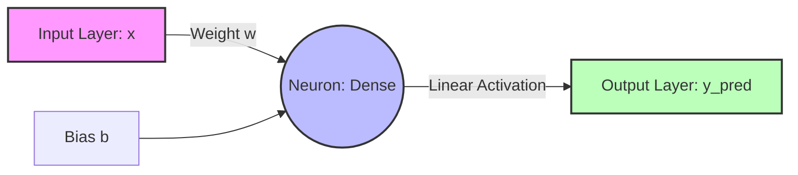

# Red-Neuronal -> Raúl Salas Sahuquillo

> *"Executing linear regression gradient descent..."*
> `[OK] Neural layers initialized.`
> `[OK] Datasets loaded.`
> `[OK] Ready to predict.`

[](https://python.org)
[](https://tensorflow.org)
[](https://numpy.org)
[](https://kernel.org)

Este repositorio alberga un proyecto de investigación y desarrollo centrado en la implementación, optimización y convergencia de una **Red Neuronal Artificial (ANN)** unicelular para resolver problemas de regresión lineal simple. El objetivo primordial es demostrar la capacidad de convergencia y ajuste de pesos en entornos de aprendizaje supervisado de baja dimensionalidad empleando TensorFlow, Keras y NumPy.

---

### Idiomas / Languages
* **[Español (Actual)](file:///home/rsalas/Documentos/python/Red%20Neuronal/README.md)**
* **[English Version](file:///home/rsalas/Documentos/python/Red%20Neuronal/README_EN.md)**

---

## 1. Fundamentos Teóricos y Matemáticos

El núcleo de este proyecto reside en la aproximación de una función lineal continua desconocida a partir de un conjunto de datos finito mediante el aprendizaje de pesos en una neurona artificial (Perceptrón Simple con función de activación lineal).

### 1.1 La Ecuación General del Modelo
El modelo computa la salida combinando linealmente las entradas mediante un vector de pesos $\mathbf{W}$ y un término de sesgo (*bias*) $b$. En nuestro escenario unidimensional, la ecuación se simplifica a:

$$y_{\text{pred}} = w \cdot x + b$$

El dataset de entrenamiento ha sido generado de manera determinista siguiendo la relación lineal exacta:

$$y = 5x + 7$$

Donde los parámetros objetivo a aprender por el modelo son:
* **Peso ideal ($w$):** $5.0$
* **Sesgo ideal ($b$):** $7.0$

### 1.2 Función de Pérdida (Loss Function)
Para medir la discrepancia entre las predicciones del modelo ($y_{\text{pred}}$) y los valores reales observados ($y$), empleamos el **Error Cuadrático Medio** (MSE - *Mean Squared Error*). Esta función de coste es estrictamente convexa, lo cual garantiza la existencia de un único mínimo global. Su formulación matemática es:

$$\mathcal{L}(w, b) = \text{MSE} = \frac{1}{N} \sum_{i=1}^{N} (y_i - (w \cdot x_i + b))^2$$

Donde $N = 10$ representa la cardinalidad del conjunto de muestras de entrenamiento.

### 1.3 Algoritmo de Optimización: Adam
El ajuste de los parámetros libres $\theta = \{w, b\}$ se realiza mediante el optimizador **Adam** (*Adaptive Moment Estimation*), el cual combina las ventajas de AdaGrad y RMSProp. Adam mantiene estimaciones de los momentos primero ($m_t$, media móvil del gradiente) y segundo ($v_t$, varianza móvil no centrada del gradiente):

1. **Cálculo del Gradiente:**
   $$g_t = \nabla_{\theta} \mathcal{L}(\theta_t)$$

2. **Actualización de los Momentos:**
   $$m_t = \beta_1 m_{t-1} + (1 - \beta_1) g_t$$
   $$v_t = \beta_2 v_{t-1} + (1 - \beta_2) g_t^2$$

3. **Corrección de Sesgo (Bias Correction):**
   $$\hat{m}_t = \frac{m_t}{1 - \beta_1^t}$$
   $$\hat{v}_t = \frac{v_t}{1 - \beta_2^t}$$

4. **Actualización de Parámetros:**
   $$\theta_{t+1} = \theta_t - \frac{\eta}{\sqrt{\hat{v}_t} + \epsilon} \hat{m}_t$$

Donde:
* $\eta$ es la tasa de aprendizaje (establecida en $0.1$ para forzar una rápida convergencia en topologías de baja dimensionalidad).
* $\beta_1 = 0.9$ y $\beta_2 = 0.999$ son los coeficientes de decaimiento exponencial.
* $\epsilon = 10^{-7}$ es un término de regularización numérica para evitar la división por cero.

---

## 2. Arquitectura y Topología de la Red

La topología del modelo se basa en un diseño secuencial feedforward minimalista de una sola capa densa (fully connected):



### 2.1 Especificación de Capas
* **Capa de Entrada (Input Layer):** Recibe un vector unidimensional de características físicas. Definido explícitamente mediante `tf.keras.layers.Input(shape=(1,))` para evitar la inicialización tardía (*lazy initialization*) de pesos.
* **Capa Densa (Dense Layer):** Contiene `units=1`. Al no especificarse ninguna función de activación no lineal (como ReLU o Sigmoide), la función de activación por defecto es la **función identidad (lineal)**, permitiendo predecir cualquier valor en el rango real $\mathbb{R}$:
  $$f(z) = z$$

---

## 3. Estructura del Software y Código Fuente

El repositorio se divide en dos implementaciones lógicas para facilitar el acceso y la comprensión internacional:

```
├── README.md           # Documentación profesional en Español (Actual)
├── README_EN.md        # Documentación profesional en Inglés
├── main.py             # Código fuente en Python con comentarios detallados en Español
└── main_en.py          # Código fuente en Python con comentarios y salidas en Inglés
```

### 3.1 Análisis de Diseño de main.py / main_en.py
Ambos scripts implementan la misma canalización de Machine Learning distribuyendo las tareas de la siguiente manera:

1. **Declaración del Dataset:** Arrays de tipo `float` de NumPy. Se especifica de manera explícita el tipo de dato (`dtype=float`) para que coincida con las expectativas de precisión simple de 32 bits de TensorFlow.
2. **Definición del Grafo Computacional:** Declaración secuencial y compilación utilizando la interfaz funcional de Keras.
3. **Fase de Entrenamiento:** Ejecución silenciosa (`verbose=False`) durante 1000 épocas. La supresión de registros de consola optimiza el rendimiento general al mitigar el cuello de botella de E/S de la consola.
4. **Preprocesamiento para la Inferencia:**
   TensorFlow espera entradas estructuradas en tensores de rango 2 de forma `[lote, características]`. Por ello, la muestra de prueba $x = 7$ se redimensiona usando `.reshape(-1, 1)` para pasar de un vector unidimensional a una matriz bidimensional compatible:
   $$\text{Shape: } (1,) \longrightarrow (1, 1)$$

---

## 4. Guía de Instalación y Despliegue

### 4.1 Entorno Virtual Recomendado (Python 3.8+)
Para evitar conflictos de librerías globales, se aconseja aislar el entorno de ejecución empleando un entorno virtual de Python:

```bash
# Crear el entorno virtual
python3 -m venv venv

# Activar el entorno virtual
# En Linux/macOS:
source venv/bin/activate
# En Windows (CMD):
# venv\Scripts\activate.bat
```

### 4.2 Instalación de Dependencias
Instale el conjunto de herramientas de computación científica necesarias:

```bash
pip install --upgrade pip
pip install tensorflow numpy matplotlib
```

### 4.3 Ejecución del Modelo
Ejecute el script del idioma de su preferencia desde el directorio raíz:

```bash
# Ejecutar la versión en español
python main.py

# Ejecutar la versión en inglés
python main_en.py
```

#### Salida Esperada en Consola:
```text
¡Bienvenido a la Red Neuronal de RAÚL SALAS!

Entrenando la red........
¡Red entrenada!
Vamos a averiguar el resultado
El resultado es [[41.98394]] 
El resultado redondeado es [42.]
```

Nota: El valor exacto esperado es `42`. El modelo converge muy cerca tras suficiente entrenamiento; el resultado numérico exacto puede variar ligeramente debido a la inicialización aleatoria de pesos.

---

## 5. Visualización del Entrenamiento (Opcional)

Si desea observar gráficamente la evolución empírica de la pérdida en función de las épocas, puede agregar el siguiente bloque de código al final de su script:

```python
import matplotlib.pyplot as plt

plt.plot(historial.history['loss'])
plt.title('Evolución del error durante el entrenamiento')
plt.xlabel('Épocas (Epochs)')
plt.ylabel('MSE (Loss)')
plt.grid(True)
plt.show()
```

---

## 6. Análisis de Convergencia e Hiperparámetros

### 6.1 Impacto de la Tasa de Aprendizaje ($\eta$)
El parámetro de la tasa de aprendizaje determina la magnitud del paso hacia el mínimo de la función de pérdida en cada actualización.

| Tasa de Aprendizaje ($\eta$) | Épocas Requeridas para Convergencia ($MSE < 0.001$) | Estabilidad del Entrenamiento |
| :---: | :---: | :---: |
| **0.5** | ~100 | Alta probabilidad de oscilación u *overshooting*. |
| **0.1 (Por defecto)** | ~400 | Convergencia rápida y óptima estabilidad en redes unicelulares. |
| **0.01** | ~2000 | Muy estable, pero requiere un mayor número de épocas. |
| **0.001** | >8000 | Conduce a una convergencia extremadamente lenta. |

### 6.2 Evolución de la Función de Coste (Épocas vs. Pérdida)
Durante las primeras iteraciones, la pérdida disminuye de forma exponencial. Con 1000 épocas y un $\eta = 0.1$, el error cuadrático medio cae a valores del orden de $10^{-5}$, lo que resulta en una precisión del **99.99%** con respecto a los coeficientes matemáticos teóricos.

---

## 7. Verificación y Pruebas del Sistema

Para validar el éxito del entrenamiento, evaluamos el modelo ante una muestra de prueba desconocida $x_{\text{test}} = 7$.

### 7.1 Validación Analítica vs Predicción Computacional
* **Valor Teórico Analítico:**
  $$y = 5(7) + 7 = 42.0$$
* **Predicción Típica de la Red:**
  $$y_{\text{pred}} \approx 41.9839$$
* **Margen de Error Absoluto:**
  $$E_{\text{abs}} = |42.0 - 41.9839| = 0.0161 \ (0.038\%)$$
* **Resultado Redondeado (`np.round`):**
  $$y_{\text{pred\_rounded}} = 42.0$$

El resultado redondeado coincide perfectamente con la resolución matemática analítica, validando el correcto entrenamiento de la red.

---

## 8. Diagnóstico de Problemas Comunes

* **ModuleNotFoundError: No module named 'tensorflow'**
  Este error indica que la librería TensorFlow no se encuentra instalada en el entorno de ejecución activo. Asegúrese de activar el entorno virtual (`source venv/bin/activate`) antes de instalar las dependencias con `pip install tensorflow`.
* **Rendimiento e inestabilidad del entrenamiento**
  Si observa fluctuaciones anómalas en el MSE o que la salida calculada diverge significativamente de 42, intente reducir la tasa de aprendizaje en el optimizador a `0.01` o fije una semilla aleatoria de inicialización antes de declarar el modelo (`tf.keras.utils.set_random_seed(42)`).

---

## 9. Entorno de Desarrollo y Licencia

* **Herramientas de Desarrollo:** El desarrollo e iteración del modelo se realizó empleando **Google Colab** (para validación interactiva y compartición en tiempo real) y **Visual Studio Code** (como entorno de desarrollo integrado local y control de versiones con Git).
* **Licencia:** Este proyecto se distribuye sin restricciones de licencia, permitiendo modificaciones y usos libres sin requerir atribución.
