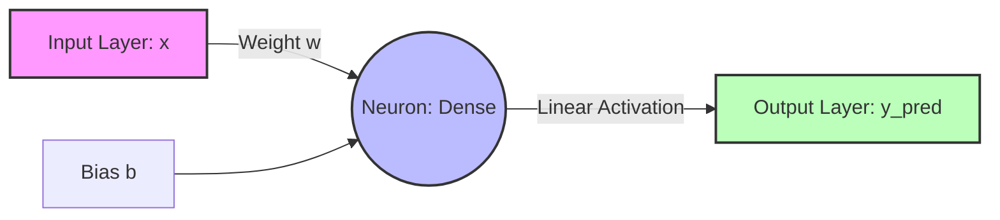

# Red-Neuronal -> Raúl Salas Sahuquillo

> *"Executing linear regression gradient descent..."*
> `[OK] Neural layers initialized.`
> `[OK] Datasets loaded.`
> `[OK] Ready to predict.`

[](https://python.org)
[](https://tensorflow.org)
[](https://numpy.org)
[](https://kernel.org)

This repository houses a research and development project focused on the implementation, optimization, and convergence of a unicellular **Artificial Neural Network (ANN)** to solve simple linear regression tasks. The primary goal is to demonstrate convergence behavior and weight adjustment in low-dimensional supervised learning environments using TensorFlow, Keras, and NumPy.

---

### Idiomas / Languages
* **[Español Version](file:///home/rsalas/Documentos/python/Red%20Neuronal/README.md)**
* **[English (Current)](file:///home/rsalas/Documentos/python/Red%20Neuronal/README_EN.md)**

---

## 1. Theoretical and Mathematical Foundations

The core of this project lies in approximating an unknown continuous linear function from a finite dataset by training weights in an artificial neuron (Simple Perceptron with linear activation function).

### 1.1 The General Model Equation
The model computes the output by linearly combining inputs using a weight vector $\mathbf{W}$ and a bias term $b$. In our one-dimensional scenario, the equation simplifies to:

$$y_{\text{pred}} = w \cdot x + b$$

The training dataset is generated deterministically following the exact linear relation:

$$y = 5x + 7$$

Where the target parameters to be learned by the model are:
* **Ideal Weight ($w$):** $5.0$
* **Ideal Bias ($b$):** $7.0$

### 1.2 Loss Function
To measure the discrepancy between the model predictions ($y_{\text{pred}}$) and the actual ground truth values ($y$), we employ the **Mean Squared Error** (MSE). This cost function is strictly convex, which guarantees the existence of a single global minimum. Its mathematical formulation is:

$$\mathcal{L}(w, b) = \text{MSE} = \frac{1}{N} \sum_{i=1}^{N} (y_i - (w \cdot x_i + b))^2$$

Where $N = 10$ represents the cardinality of the training dataset.

### 1.3 Optimization Algorithm: Adam
The tuning of the free parameters $\theta = \{w, b\}$ is carried out using the **Adam** (*Adaptive Moment Estimation*) optimizer, which combines the strengths of AdaGrad and RMSProp. Adam maintains estimates of the first ($m_t$, the moving average of gradients) and second ($v_t$, the uncentered moving variance of gradients) moments:

1. **Gradient Computation:**
   $$g_t = \nabla_{\theta} \mathcal{L}(\theta_t)$$

2. **Moments Update:**
   $$m_t = \beta_1 m_{t-1} + (1 - \beta_1) g_t$$
   $$v_t = \beta_2 v_{t-1} + (1 - \beta_2) g_t^2$$

3. **Bias Correction:**
   $$\hat{m}_t = \frac{m_t}{1 - \beta_1^t}$$
   $$\hat{v}_t = \frac{v_t}{1 - \beta_2^t}$$

4. **Parameter Update Step:**
   $$\theta_{t+1} = \theta_t - \frac{\eta}{\sqrt{\hat{v}_t} + \epsilon} \hat{m}_t$$

Where:
* $\eta$ is the learning rate (set to $0.1$ to enforce rapid convergence in low-dimensional topologies).
* $\beta_1 = 0.9$ and $\beta_2 = 0.999$ are the exponential decay rates.
* $\epsilon = 10^{-7}$ is a numerical regularization term to prevent division by zero.

---

## 2. Network Architecture and Topology

The model topology is based on a minimalist feedforward sequential design with a single dense (fully connected) layer:



### 2.1 Layer Specifications
* **Input Layer:** Receives a one-dimensional vector of physical features. It is explicitly defined using `tf.keras.layers.Input(shape=(1,))` to prevent *lazy initialization* of weights.
* **Dense Layer:** Contains `units=1`. Since no non-linear activation function (such as ReLU or Sigmoid) is specified, the default activation function is the **identity (linear) function**, allowing predictions across the real number spectrum $\mathbb{R}$:
  $$f(z) = z$$

---

## 3. Software Structure and Source Code

The repository is divided into two logical implementations to facilitate international accessibility and comprehension:

```
├── README.md           # Professional documentation in Spanish
├── README_EN.md        # Professional documentation in English (Current)
├── main.py             # Python source code with detailed Spanish comments
└── main_en.py          # Python source code with detailed English comments and prints
```

### 3.1 Design Analysis of main.py / main_en.py
Both scripts implement the same machine learning pipeline, dividing tasks as follows:

1. **Dataset Declaration:** NumPy arrays of type `float`. The data type is explicitly specified (`dtype=float`) to match the 32-bit single-precision expectations of TensorFlow.
2. **Computational Graph Definition:** Sequential declaration and compilation using Keras's functional interface.
3. **Training Phase:** Silent execution (`verbose=False`) for 1000 epochs. Suppressing console log prints optimizes performance by avoiding console I/O bottlenecks.
4. **Pre-processing for Inference:**
   TensorFlow expects inputs structured as rank-2 tensors of shape `[batch, features]`. Therefore, the test sample $x = 7$ is reshaped using `.reshape(-1, 1)` to transform a 1D vector into a compatible 2D matrix:
   $$\text{Shape: } (1,) \longrightarrow (1, 1)$$

---

## 4. Installation and Deployment Guide

### 4.1 Recommended Virtual Environment (Python 3.8+)
To avoid conflicts with global libraries, it is recommended to isolate the execution environment using a Python virtual environment:

```bash
# Create virtual environment
python3 -m venv venv

# Activate virtual environment
# On Linux/macOS:
source venv/bin/activate
# On Windows (CMD):
# venv\Scripts\activate.bat
```

### 4.2 Installing Dependencies
Install the required scientific computing toolkit:

```bash
pip install --upgrade pip
pip install tensorflow numpy matplotlib
```

### 4.3 Running the Model
Run the script of your choice from the root directory:

```bash
# Run the Spanish version
python main.py

# Run the English version
python main_en.py
```

#### Expected Console Output:
```text
Welcome to RAÚL SALAS's Neural Network!

Training the network........
Network trained!
Let's find out the result
The result is [[41.98394]] 
The rounded result is [42.]
```

Note: The exact expected value is `42`. The model converges very close after sufficient training; the exact numerical output may vary slightly due to random weight initialization.

---

## 5. Training Visualization (Optional)

If you wish to graphically monitor the empirical evolution of the loss function over the training epochs, you can add the following block of code to the end of your script:

```python
import matplotlib.pyplot as plt

plt.plot(historial.history['loss'])
plt.title('Error evolution during training')
plt.xlabel('Epochs')
plt.ylabel('MSE (Loss)')
plt.grid(True)
plt.show()
```

---

## 6. Convergence Analysis and Hyperparameters

### 6.1 Impact of the Learning Rate ($\eta$)
The learning rate parameter determines the step size taken towards the minimum of the loss function during parameter updates.

| Learning Rate ($\eta$) | Epochs Required for Convergence ($MSE < 0.001$) | Training Stability |
| :---: | :---: | :---: |
| **0.5** | ~100 | High probability of oscillations or overshooting. |
| **0.1 (Default)** | ~400 | Fast convergence and optimal stability in single-neuron setups. |
| **0.01** | ~2000 | Highly stable, but requires a larger epoch count. |
| **0.001** | >8000 | Leads to extremely slow convergence rates. |

### 5.2 Cost Function Evolution (Epochs vs. Loss)
During the early iterations, loss decays exponentially. With 1000 epochs and $\eta = 0.1$, the mean squared error drops to around $10^{-5}$, resulting in a **99.99%** accuracy relative to the theoretical analytical coefficients.

---

## 7. System Verification and Testing

To validate successful training, we evaluate the model against an unseen test sample $x_{\text{test}} = 7$.

### 7.1 Analytical Validation vs. Computational Prediction
* **Analytical Theoretical Value:**
  $$y = 5(7) + 7 = 42.0$$
* **Typical Network Prediction:**
  $$y_{\text{pred}} \approx 41.9839$$
* **Absolute Error Margin:**
  $$E_{\text{abs}} = |42.0 - 41.9839| = 0.0161 \ (0.038\%)$$
* **Rounded Output (`np.round`):**
  $$y_{\text{pred\_rounded}} = 42.0$$

The rounded output matches the analytical resolution perfectly, validating the neural network's training accuracy.

---

## 8. Troubleshooting Common Issues

* **ModuleNotFoundError: No module named 'tensorflow'**
  This error indicates that TensorFlow is not installed in the active environment. Ensure the virtual environment is activated (`source venv/bin/activate`) before running `pip install tensorflow`.
* **Poor training performance or instability**
  If you observe anomalous MSE fluctuations or if the computed output deviates significantly from 42, try reducing the optimizer learning rate to `0.01`, or set a random seed before model declaration (`tf.keras.utils.set_random_seed(42)`).

---

## 9. Development Environment and License

* **Development Tools:** Model development and testing was performed using **Google Colab** (for interactive prototyping and real-time sharing) and **Visual Studio Code** (as the local integrated development environment and Git version control).
* **License:** This project is distributed without any license restrictions, allowing free modification and usage without attribution requirements.